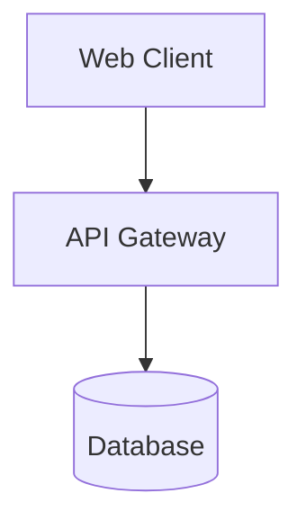

# Examples

## Example 1: Auto-detect PDF

**Input:** `Resources/quarterly-report.pdf`

```bash
python Scripts/convert.py --input Resources/quarterly-report.pdf --output output/
```

**Output:**
```
output/quarterly-report/quarterly-report.md
output/quarterly-report/quarterly-report_assets/   (if images extracted)
```

**Sample MD head:**
```markdown
---
title: "quarterly-report"
source: "Resources/quarterly-report.pdf"
converter: "pdf_to_md"
generated_at: "2026-06-08T10:00:00+00:00"
azure: "true"
---

## Executive Summary

Revenue increased by 12%...
```

## Example 2: Markdown to Word with template

```bash
python Scripts/convert.py md-to-docx \
  --input output/quarterly-report/quarterly-report.md \
  --template template/default.docx \
  --output output/
```

**Output:** `output/quarterly-report/quarterly-report.docx`

## Example 3: Flowchart JSON to draw.io

**Input:** `Resources/onboarding-flow.json`

```json
{
  "name": "Onboarding",
  "nodes": [
    {"key": "start", "label": "New User"},
    {"key": "verify", "label": "Verify Email"},
    {"key": "done", "label": "Active"}
  ],
  "edges": [
    {"source": "start", "target": "verify"},
    {"source": "verify", "target": "done", "label": "confirmed"}
  ]
}
```

```bash
python Scripts/chart_to_drawio.py \
  --input Resources/onboarding-flow.json \
  --output output/onboarding-flow.drawio
```

Open `output/onboarding-flow.drawio` in [diagrams.net](https://app.diagrams.net/).

## Example 4: Mermaid to draw.io

**Input:** `Resources/architecture.mmd`



```bash
python Scripts/chart_to_drawio.py --input Resources/architecture.mmd --output output/architecture.drawio
```

## Example 5: Excel with chart placeholder

```bash
python Scripts/convert.py xlsx-to-md --input Resources/sales.xlsx --output output/
```

**MD excerpt:**
```markdown
## Q1 Sales

| Region | Revenue |
| --- | --- |
| North | 100000 |

[Edit chart in draw.io](charts/Q1 Sales_chart1.drawio)
```

## Example 6: Batch

```bash
python Scripts/convert.py batch --input Resources/ --output output/
```

Converts all supported files in `Resources/` to corresponding outputs under `output/`.

## Example 7: Agent-generated content

Agent creates new documentation:

```markdown
---
title: "API Design Guide"
source: "agent-generated"
converter: "manual"
generated_at: "2026-06-08T12:00:00+00:00"
---

# API Design Guide

## Authentication

All endpoints require Bearer token...

## Architecture

[View architecture diagram](charts/api-arch.drawio)
```

Then:
```bash
python Scripts/chart_to_drawio.py --input Resources/api-arch.json --output output/api-design-guide/charts/api-arch.drawio
python Scripts/convert.py md-to-docx --input output/api-design-guide/API\ Design\ Guide.md
```
